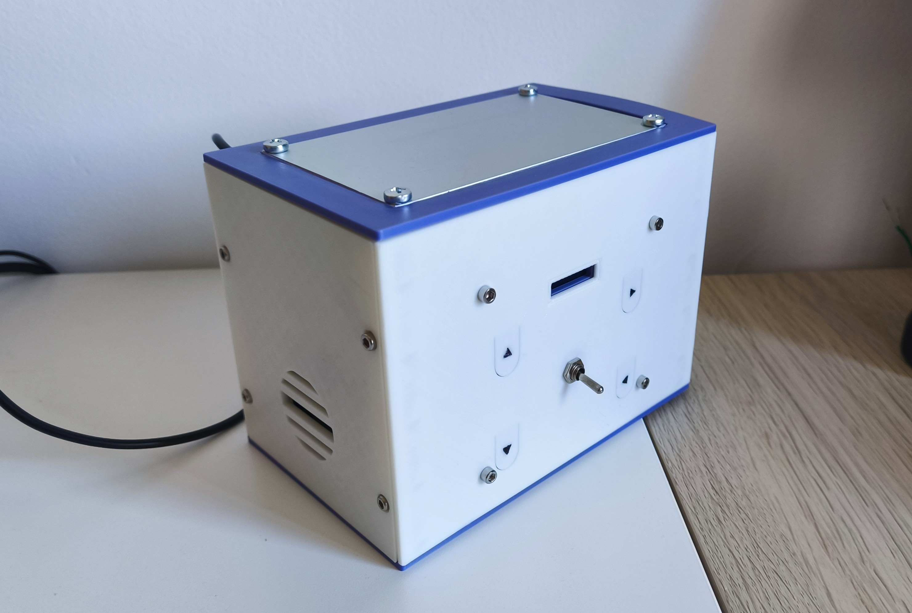
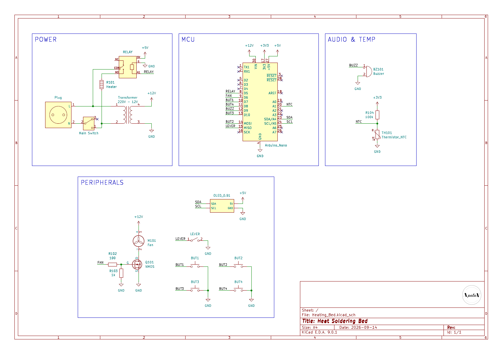
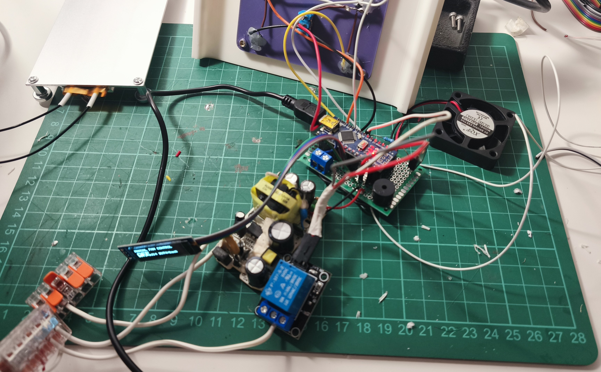
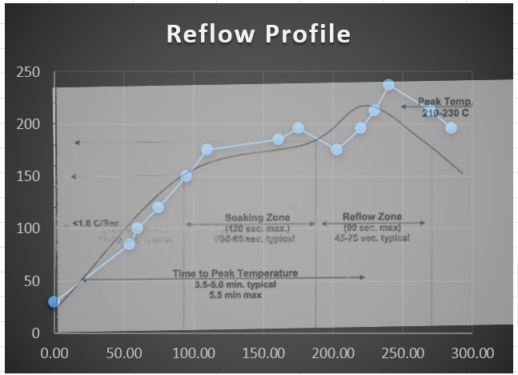

# PCB Heated Soldering Bed

<p align="center">
  
</p>

Custom PCB based heating bed for PCB assembly and solder reflow.

The system uses an Arduino Nano to control a relay that powers a resistive heating plate, monitor temperature with an NTC thermistor, control a cooling fan, and provide a simple OLED interface.

Different buttons provide the user an easy way to navigate through the different menus available in the screen. The reflow profile can be modified, create a new one, power the fan or leave it in automatic mode... The main lever powers the heating element, initiating the reflow process. 

To avoid melting the internals, the heating element was secured with 4 x M4 bolts capable of disipating the heat to the lower part of the assembly. The main structure consists of 6 panels total, secured together with screws and threaded inserts.

---

## Features

| Feature | Description |
|---|---|
| Controller | Arduino Nano |
| Heater | 220 V heating element |
| Temperature sensor | NTC thermistor |
| Heater control | Relay |
| Cooling | 12 V fan + N-MOSFET |
| Display | 0.91" 128×32 I2C OLED |
| User input | 4 buttons + safety lever |
| Audio | Buzzer |
| Modes | Manual heating / Reflow |
| Reflow profile | Sn63Pb37 |
| Temperature range | 30–230 °C |
| Temperature ramp | 1 °C/s |

---

## Hardware

### Components

| Component | Reference | Specification |
|---|---|---|
| Arduino Nano | U101 | Main controller |
| Heating element | Heater | 12 V |
| Relay | R101 | 5 V |
| NTC thermistor | TH101 | Temperature measurement |
| MOSFET | Q101 | N-channel |
| Fan | M101 | 12 V |
| OLED | OLED_0.91 | 128×32, I2C |
| Buzzer | BZ101 | Audio indication |
| Transformer | T1 | 220 V AC → 12 V |
| Main switch | SW1 | Power switch |
| BUT1–BUT4 | — | User controls |
| LEVER | — | Safety input |
| R101 | — | 100 kΩ |
| R102 | — | 100 Ω |
| R103 | — | 1 kΩ |
| R104 | — | — |

---

## Schematic & Wiring

<table>
<tr>
<td width="50%" align="center" valign="top">

<b>Schematic</b><br><br>



</td>

<td width="50%" align="center" valign="top">

<b>Internals / Wiring</b><br><br>



</td>
</tr>
</table>

---

## Reflow Profile

| Stage | Target | Duration |
|---|---:|---:|
| Stage 1 | 150 °C | 60 s |
| Stage 2 | 180 °C | 60 s |
| Stage 3 | 210 °C | 30 s |

Setpoint ramp: **1 °C/s**

---

## Reflow Test

<p align="center">
  
</p>

| Profile | Description |
|---|---|
| Theory | Target temperature profile |
| Real | Temperature measured during the test |

The difference is mainly caused by thermal inertia, heater power, heat losses, sensor position, and control response.

---

## Temperature Control

| Parameter | Value |
|---|---:|
| Series resistor | 100 kΩ |
| Nominal resistance | 75 kΩ |
| Nominal temperature | 20 °C |
| Beta coefficient | 4092 |

```cpp
const float SERIES_RESISTOR      = 100000.0;
const float NOMINAL_RESISTANCE   = 75000.0;
const float NOMINAL_TEMPERATURE  = 20.0;
const float B_COEFFICIENT        = 4092.0;
